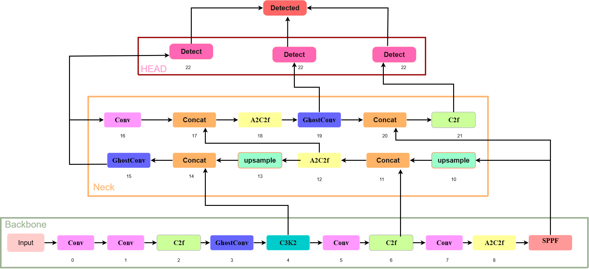

# TOM-YOLO-Tomato-Leaf-Disease-Detection
RAAICON 2025
## 📌 Overview
Tomato leaf diseases significantly impact agricultural productivity. Early and accurate detection is essential for sustainable crop management.

This repository presents **TOM-YOLO**, an enhanced YOLOv12 framework for real-time detection and classification of nine tomato leaf diseases under complex field conditions.

## 🚀 Key Contributions

- GhostConv layers at positions 3, 15, 19 to reduce redundancy and improve speed  
- A2C2f blocks for better feature representation  
- SPPF module at layer 9 for multi-scale context  
- C2f modules in backbone and neck for fine-grained lesion detection  
- Custom detection head for nine tomato leaf disease categories  

## 📊 Performance Metrics

| Metric        | Value   |
|---------------|---------|
| Precision     | 87.5%   |
| Recall        | 81.1%   |
| F1-score      | 84.0%   |
| mAP@50        | 90.4%   |
| mAP@50-95     | 77.9%   |

---

## 🧠 Model Architecture

## 📊 Dataset

This work uses the Tomato Leaf Diseases dataset hosted on Roboflow Universe:

🔗 https://universe.roboflow.com/dyploma/tomato-leaf-diseases-4xa5i

> License: CC BY 4.0  
> Classes: Early Blight, Healthy, Late Blight, Leaf Miner, Leaf Mold, Mosaic Virus, Septoria, Spider Mites, Yellow Leaf Curl Virus. :contentReference[oaicite:3]{index=3}

